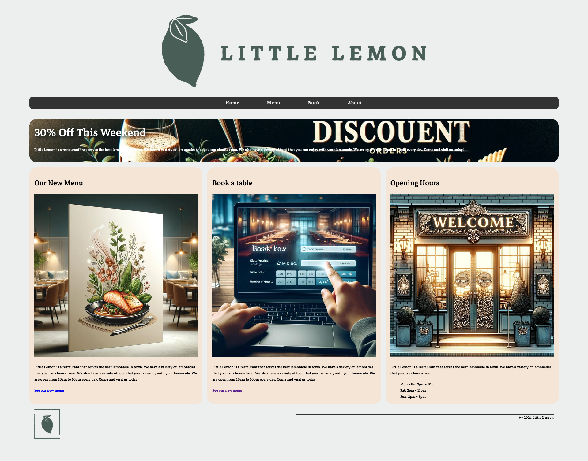
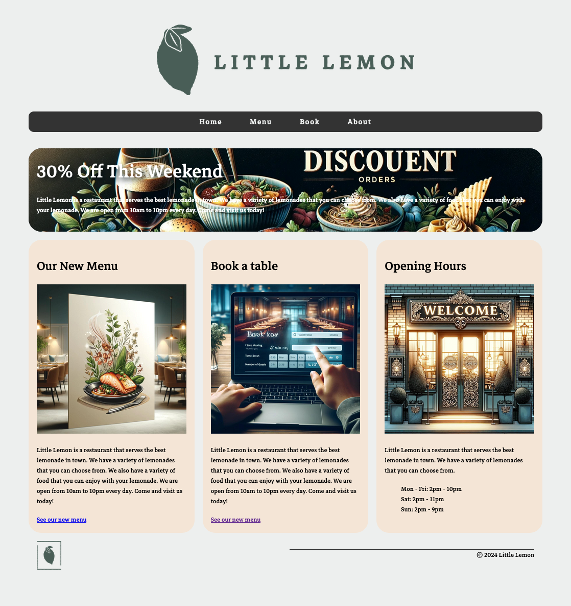
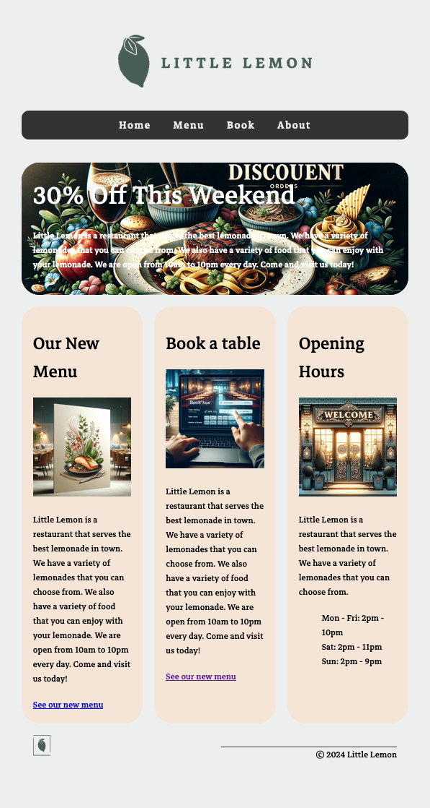

# Coursera - HTML and CSS in depth: Portfolio project

## Getting started

- Project developed under [vscode](https://code.visualstudio.com/download) on macOS 14.4.1.
- vscode [Live Server](https://marketplace.visualstudio.com/items?itemName=ritwickdey.LiveServer) extension is used to serve web pages locally
- Tested under the 3 main web browsers latest version who are: 
  - Google Chrome
  - Apple Safari
  - Mozilla Firefox

## Demo

<video autoplay loop muted>
    <source src="docs/mov/demo.mp4" type="video/mp4" />
</video>

https://github.com/gmocquet/coursera-html-and-css-in-depth-portfolio-project/assets/1082289/f0ac9561-598d-46f7-b9ec-b2abdb5cfd99

## Samples

Full width (viewport width: 1920px) 

~ Half screen (viewport width: 1118px) 

~ Quarter screen (viewport width: 597px) 

